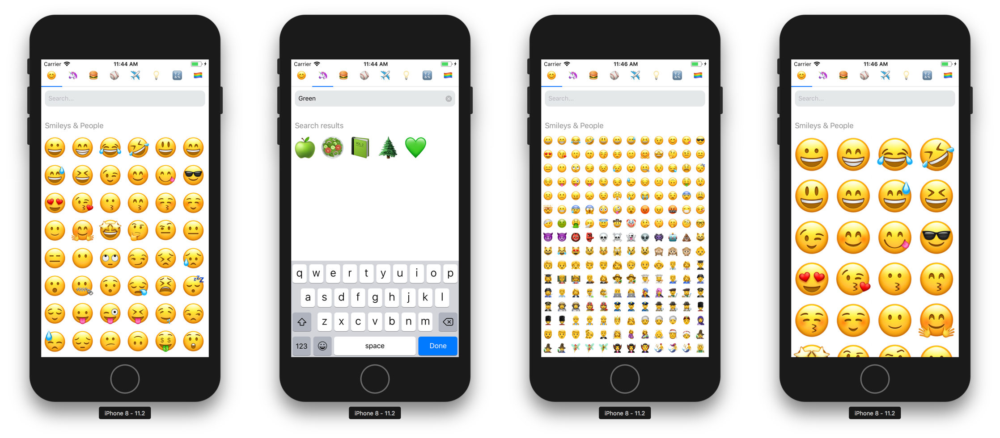

# react-native-emoji-selector



## Installation

```
npm install --save react-native-emoji-selector
```

```
import EmojiSelector from 'react-native-emoji-selector'
```

## Demo


## Usage

### Basic usage

```jsx
<EmojiSelector onEmojiSelected={emoji => console.log(emoji)} />
```

### Setting a default category

If you'd like to define a different default category, you can import the `Categories` class. Setting a default category can also improve performance by loading a single section rather than all sections at once.

```jsx
import EmojiSelector, { Categories } from "react-native-emoji-selector";

<EmojiSelector
  category={Categories.symbols}
  onEmojiSelected={emoji => console.log(emoji)}
/>;
```

The available categories are `all`, `emotion`, `people`, `nature`, `food`, `activities`, `places`, `objects`, `symbols`, and `flags`.

## Props

| Prop              | Type     | Default       | Description                                              |
| ----------------- | -------- | ------------- | -------------------------------------------------------- |
| onEmojiSelected   | _func_   |               | Function called when a user selects an Emoji             |
| theme             | _string_ | `"007AFF"`    | Theme color used for loaders and active tab indicator    |
| showTabs          | _bool_   | `true`        | Toggle the tabs on or off                                |
| showSearchBar     | _bool_   | `true`        | Toggle the searchbar on or off                           |
| showHistory       | _bool_   | `false`       | Toggle the history tab on or off                         |
| showSectionTitles | _bool_   | `true`        | Toggle the section title elements                        |
| category          | _enum_   | `"all"`       | Set the default category. Use the `Categories` class     |
| columns           | _number_ | `6`           | Number of columns accross                                |
| placeholder       | _string_ | `"Search..."` | A string placeholder when there is no text in text input |
| shouldInclude     | _func_   |               | Function called to check for emoji inclusion             |

## Contributors

Special thanks to everyone who has contributed to this project!

[](https://github.com/victorkvarghese)
[](https://github.com/ma96o)
[](https://github.com/mateosilguero)
[](https://github.com/St1ma)
[](https://github.com/sseppola)
[](https://github.com/lucasfeijo)
